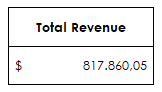
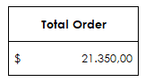
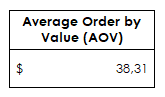
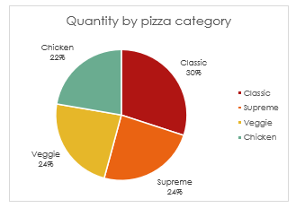
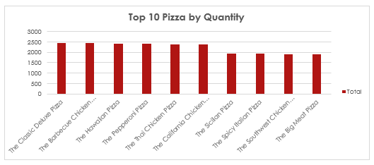
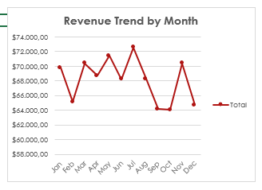
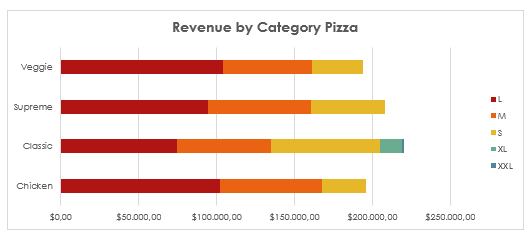
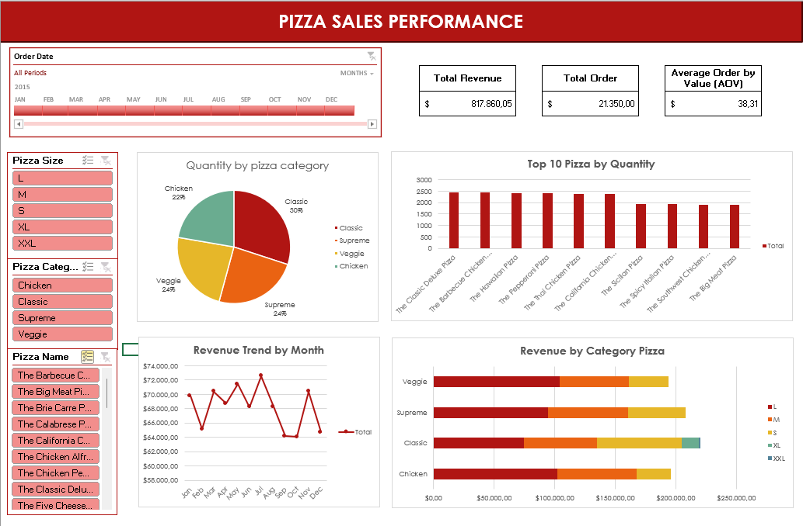

# 🍕 Pizza Sales Dashboard

## 📘 Project Overview
This project aims to analyze **pizza sales performance** using **Microsoft Excel**.  
By utilizing **Pivot Tables** and **interactive charts**, this dashboard provides insights into key business metrics such as revenue, order trends, and product performance.

---

## 🧰 Tools and Dataset
- **Tool:** Microsoft Excel (Pivot Table, Chart, Dashboard)
- **Dataset:** Pizza Sales Dataset (CSV format)
- **Visualization:** Excel Dashboard

---

## 📑 Table of Contents
- [STAGE 0: Problem Statement](#-stage-0-problem-statement)
  - Background Story  
  - Objective
- [STAGE 1: Data Preparation](#-stage-1-data-preparation)
- [STAGE 2: Data Analysis](#-stage-2-data-analysis)
  - Total Revenue  
  - Total Orders  
  - Average Order Value (AOV)  
  - Quantity per Category  
  - Top 10 Pizza by Quantity  
  - Revenue Trend by Month  
  - Revenue by Pizza Category and Size
- [STAGE 3: Summary](#-stage-3-summary)
- [Dashboard Preview](#-dashboard-preview)
- [Repository Structure](#-repository-structure)

---

## 📂 STAGE 0: Problem Statement

### 🎯 Background Story
Penjualan pizza merupakan salah satu bisnis kuliner yang sangat kompetitif.  
Dengan data penjualan yang terus bertambah, perusahaan perlu **mengukur performa bisnis** untuk memahami tren pelanggan, kategori terlaris, serta potensi peningkatan penjualan.  

Melalui proyek ini, dilakukan analisis **Pizza Sales Data** menggunakan **Microsoft Excel** untuk mengidentifikasi metrik kunci bisnis dan membantu pengambilan keputusan strategis.

### 🎯 Objective
Membuat dashboard interaktif di Excel untuk menampilkan insight utama, yaitu:
- Total Revenue  
- Total Order  
- Average Order Value (AOV)  
- Quantity per Category  
- Top 10 Pizza by Quantity  
- Revenue Trend by Month  
- Revenue by Pizza Category and Size  

---

## 📂 STAGE 1: Data Preparation

### 🔧 Dataset Description
Dataset ini berisi transaksi penjualan pizza dengan beberapa kolom utama:
- **Order ID** – kode unik setiap pesanan  
- **Pizza Name** – nama pizza  
- **Category** – kategori pizza (Classic, Supreme, Veggie, dll)  
- **Size** – ukuran pizza (S, M, L, XL)  
- **Quantity** – jumlah yang dipesan  
- **Price** – harga per unit  
- **Date** – tanggal transaksi  

### 🧹 Data Cleaning and Setup
1. Mengimpor data dari file CSV ke Excel.  
2. Membersihkan data (menghapus duplikat, memastikan format tanggal, dan menstandarkan nama kategori).  
3. Menambahkan kolom baru **Revenue** dengan formula:
4. Mengubah data range menjadi **Excel Table** untuk mempermudah analisis pivot.  

---

## 📂 STAGE 2: Data Analysis

### 📊 1. Total Revenue
Menghitung total pendapatan keseluruhan dari seluruh transaksi.  
Menunjukkan performa bisnis secara keseluruhan.  

> **Insight:** Total revenue menjadi metrik utama untuk mengukur keberhasilan penjualan.

---

### 🧾 2. Total Orders
Menghitung jumlah order unik berdasarkan `Order ID`.  

> **Insight:** Semakin banyak order, semakin besar potensi revenue dan jangkauan pelanggan.

---

### 💰 3. Average Order Value (AOV)
Menghitung rata-rata nilai transaksi pelanggan:  

> **Insight:** Menunjukkan seberapa besar pelanggan berbelanja dalam satu pesanan.

---

### 🍕 4. Quantity per Category
Menganalisis jumlah pizza yang terjual berdasarkan kategori.  
Visualisasi menggunakan **Bar Chart (Pivot Chart)**.  

> **Insight:** Kategori *Classic* mendominasi jumlah penjualan, menunjukkan preferensi pelanggan terhadap varian klasik.

---

### 🏆 5. Top 10 Pizza by Quantity
Menampilkan 10 menu pizza dengan penjualan tertinggi.  

> **Insight:** Pizza tertentu mendominasi penjualan dan bisa dijadikan fokus promosi atau rekomendasi utama.

---

### 📈 6. Revenue Trend by Month
Menunjukkan perubahan revenue setiap bulan selama periode analisis.  
Visualisasi dengan **Line Chart**.  

> **Insight:** Terjadi peningkatan revenue pada bulan-bulan tertentu (misal akhir tahun), yang bisa dimanfaatkan untuk strategi promosi musiman.

---

### 🍽️ 7. Revenue by Pizza Category and Size
Analisis pendapatan berdasarkan kombinasi **kategori pizza** dan **ukuran**.  
Visualisasi dengan **Clustered Column Chart**.  

> **Insight:** Pizza dengan ukuran *Large* dari kategori *Supreme* memberikan kontribusi revenue tertinggi.

---

## 📂 STAGE 3: Summary
Dari hasil analisis, dapat disimpulkan bahwa:
- **Classic pizza** memiliki volume penjualan tertinggi, namun **Supreme Large** menghasilkan pendapatan terbesar.  
- **Average Order Value** memberikan gambaran perilaku pelanggan dalam berbelanja.  
- **Tren bulanan** menunjukkan adanya periode penjualan tinggi yang dapat dijadikan momentum promosi.  
- Dashboard ini mempermudah pemantauan performa bisnis secara real-time dan membantu pengambilan keputusan berbasis data.

---

## 📊 Dashboard Preview
Berikut tampilan **Pizza Sales Dashboard** yang dibuat dengan Microsoft Excel:

> Dashboard menampilkan KPI utama (Total Revenue, Total Order, AOV) serta berbagai visualisasi interaktif menggunakan Pivot Table dan Chart.

---
